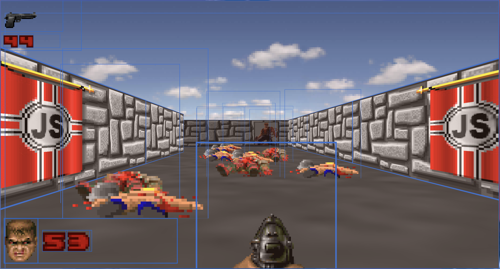

# Doom Nukem CSS

3D shooter written with HTML/CSS/Typescript that renders scene using HTML and CSS, no canvas 😅

[Live demo](https://yurkagon.github.io/Doom-Nukem-CSS/)

Its not playable like a normal game, the whole level is empty but anyway I guess it should be an interesting thing :)

## Features

- Doom-like menu 😎
- Camera
- Player movement
- Levels
- Collision (for player or enemies)
- Sprites
- Enemies
- Weapons (only 2 ones: pistol and shotgun)
- Shooting
- Health
- Night level

## Technologies used

The Doom like menu is built by React

To manipulate with the 3D level I use only JQuery

### Rendering

Everything you see is built by HTML5 \

### Night level

## Also

- [Check my Raycasting engine written in HTML using React](https://github.com/yurkagon/ReactCasting)

## Contributors

